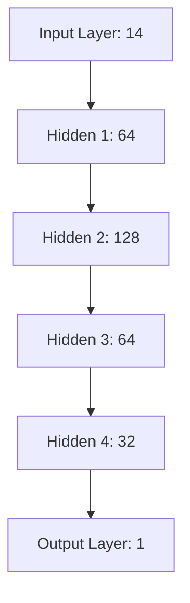

# Model Architecture

## Core Design
The primary architecture for this project is a Multi-Layer Perceptron (MLP) built in PyTorch. It is designed specifically for nonlinear regression tasks, taking the 14-dimensional input feature vector and mapping it to a continuous 1-dimensional output (MPG).

### Default Architecture
- **Type**: Multi-Layer Perceptron (MLP)
- **Input Dimension**: 14 (see [Dataset](dataset.md))
- **Hidden Layers**: `[64, 128, 64, 32]`
- **Output Dimension**: 1
- **Total Parameters**: ~21,000

### Configurable Features
- **Activation Functions**: Configurable per layer (see [Activation Guide](activation_guide.md)).
- **Batch Normalization**: Optional, stabilizes learning over deep variants.
- **Dropout**: Optional, prevents overfitting on the highly interactive dataset.
- **Residual Connections**: Optional skip connections spanning hidden blocks to prevent vanishing gradients in very deep configurations.

## Why Nonlinear Regression?
By the **Universal Function Approximation Theorem**, a neural network with at least one hidden layer and a non-linear activation function can approximate any continuous function $f: \mathbb{R}^{14} \to \mathbb{R}$ to an arbitrary degree of accuracy.

### Comparison with Classical Regression
Ordinary Least Squares (OLS) or simple Ridge/Lasso regression fundamentally assume linear additivity between features. Because our target incorporates exponential terms, trigonometric cycles, and explicit feature cross-products (e.g., $turbo \times engine\_size$), a linear model cannot capture the target space without exhaustive manual feature engineering (e.g., explicitly passing polynomials and cross-terms). The MLP discovers these interaction terms inherently during backpropagation.

## Training Details
- **Optimizer**: Adam
- **Learning Rate Schedule**: Cosine Annealing LR (`CosineAnnealingLR`)
- **Loss Function**: Mean Squared Error (MSE)

## Evaluation Metrics
We track a comprehensive suite of regression metrics:
- **MSE** (Mean Squared Error): Default loss, sensitive to outliers.
- **RMSE** (Root Mean Squared Error): Interpretable scale (same units as MPG).
- **MAE** (Mean Absolute Error): Robust to heteroscedastic noise.
- **R²** (Coefficient of Determination): Explained variance.
- **Max Error**: Useful for identifying extreme edge cases in inference.
- **Median AE** (Median Absolute Error): Less impacted by the target's heteroscedastic noise component.
